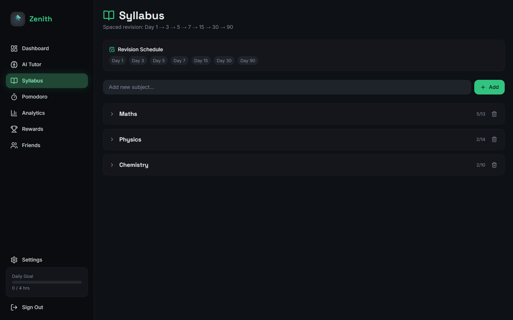
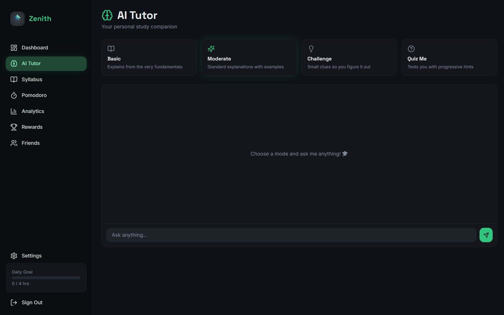
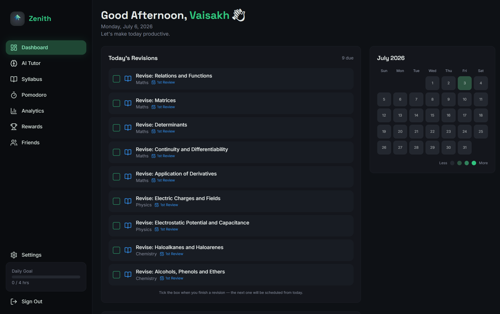
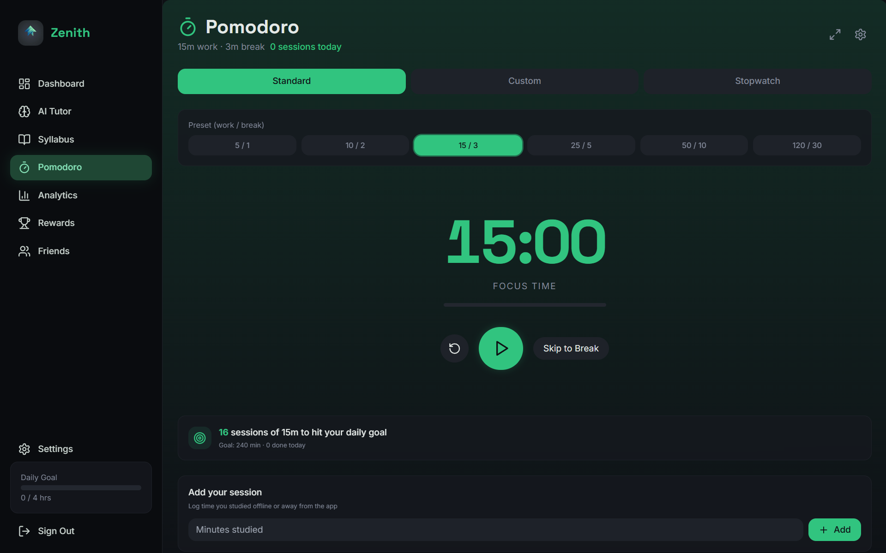
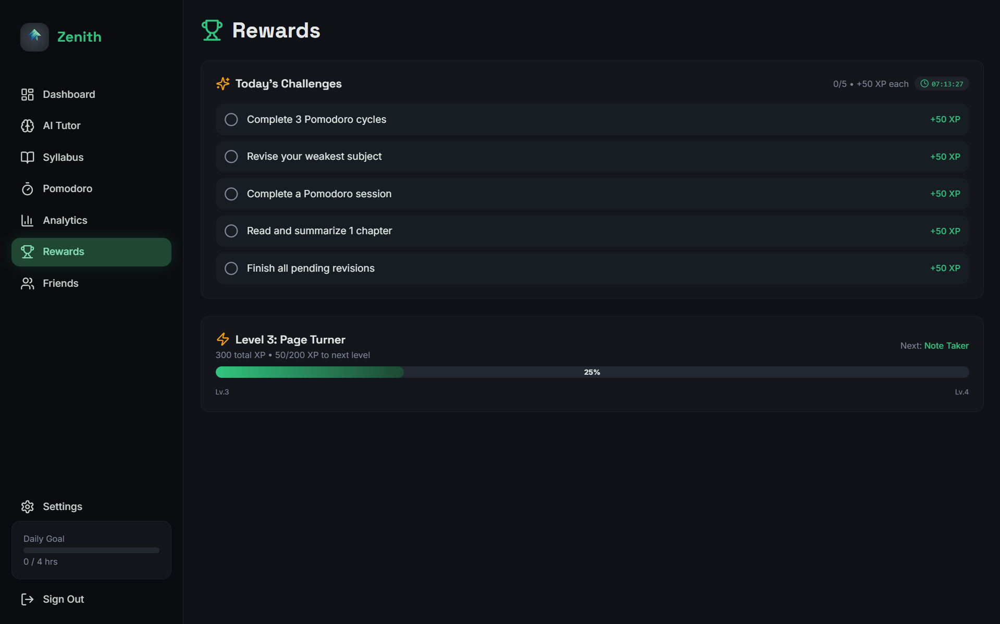
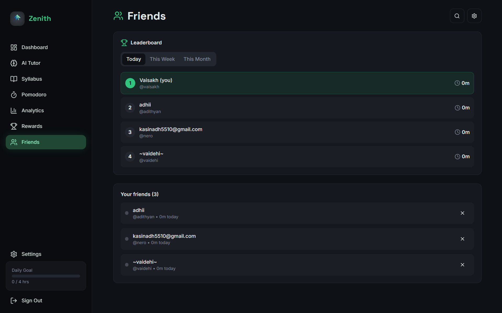

# 🚀 Zenith — AI Powered Study Management Platform

<div align="center">

### Study Smarter • Stay Consistent • Learn Better

Zenith is an intelligent study ecosystem designed to improve productivity, learning efficiency, and long-term retention through AI, spaced repetition, analytics, and gamification.

🌐 Live Demo: https://zenith-two-amber.vercel.app/


</div>

---

# 📖 About Zenith

Zenith was built around a simple question:

> Why do students forget so much of what they study?

Traditional study apps mainly focus on task management. Zenith goes further by integrating:

- Artificial Intelligence
- Spaced Repetition
- Productivity Systems
- Social Motivation
- Gamification
- Learning Analytics

Instead of simply tracking tasks, Zenith helps students **understand concepts deeply, revise effectively, and stay consistent over time.**

---

# ✨ Core Features

---

## 📚 Smart Syllabus Tracking

Students can organize their entire syllabus and monitor progress in a structured way.

Features:

✅ Subject management

✅ Topic completion tracking

✅ Progress indicators

✅ Automatic revision scheduling

Zenith automatically schedules revisions using spaced repetition intervals:

```text
Day 1 → Day 3 → Day 5 → Day 7 → Day 15 → Day 30 → Day 90
```

This reduces forgetting and improves long-term memory retention.

### Screenshot



---

## 🤖 AI Tutor

Zenith includes a personalized AI tutor that adapts to different learning styles.

Available modes:

### 📖 Basic

Explains concepts from the very fundamentals.

Best for:

- Beginners
- First-time learners

### 💡 Moderate

Provides balanced explanations with examples.

Best for:

- Regular studying
- Concept clarification

### 🔥 Challenge Mode

Provides only hints and clues.

Best for:

- Critical thinking
- Problem solving

### 📝 Quiz Mode

Tests understanding using active recall.

Best for:

- Revision
- Self-evaluation

### Screenshot



---

## 📊 Dashboard & Analytics

Zenith provides an overview of daily study activity and revision progress.

Features:

- Daily revision reminders
- Pending revision tracking
- Study statistics
- Calendar view
- GitHub-style study heatmap

The heatmap gradually becomes darker as study consistency improves.

### Screenshot



---

## ⏳ Productivity System

Zenith includes multiple focus tools designed around different study styles.

### Pomodoro Presets

🍅 5 / 1

🍅 10 / 2

🍅 15 / 3

🍅 25 / 5

🍅 50 / 10

🍅 120 / 30

Additional tools:

- Custom timer
- Stopwatch
- Session tracking
- Daily goals

### Screenshot



---

## 🏆 Rewards & Gamification

Consistency becomes rewarding through an XP-based progression system.

Features:

- Daily challenges
- XP rewards
- Achievement system
- Levels and progression
- Motivation tracking

The goal is to transform studying into a rewarding experience rather than a repetitive task.

### Screenshot



---

## 👥 Friends & Leaderboards

Learning becomes more engaging when students grow together.

Features:

- Add friends
- Study leaderboards
- Daily/Weekly/Monthly rankings
- Compare study consistency
- Healthy competition

### Screenshot



---

# 🛠 Tech Stack

### Frontend

- Next.js
- React
- Tailwind CSS

### Backend

- Node.js

### Authentication

- User Authentication System

### AI

- Large Language Models
- Personalized Tutoring Logic

### Deployment

- Vercel

---

# 🧠 System Workflow

```text
Student Input
      ↓
Syllabus Creation
      ↓
Topic Completion
      ↓
Spaced Repetition Scheduling
      ↓
AI Tutor Assistance
      ↓
Pomodoro Tracking
      ↓
Rewards + Leaderboards + Analytics
```

---

# 🎯 Future Improvements

Planned features:

- Adaptive revision intervals
- AI-generated study plans
- Personalized learning paths
- Subject-specific tutors
- Performance prediction analytics
- Community study rooms
- Mobile application

---

# 💡 Vision

> Education should not only help students score better.

> It should help students understand, remember, and grow.

Zenith was built with the vision of creating a smarter, more engaging, and more personalized learning experience.

---

<div align="center">

Made with ❤️ for students

</div>
